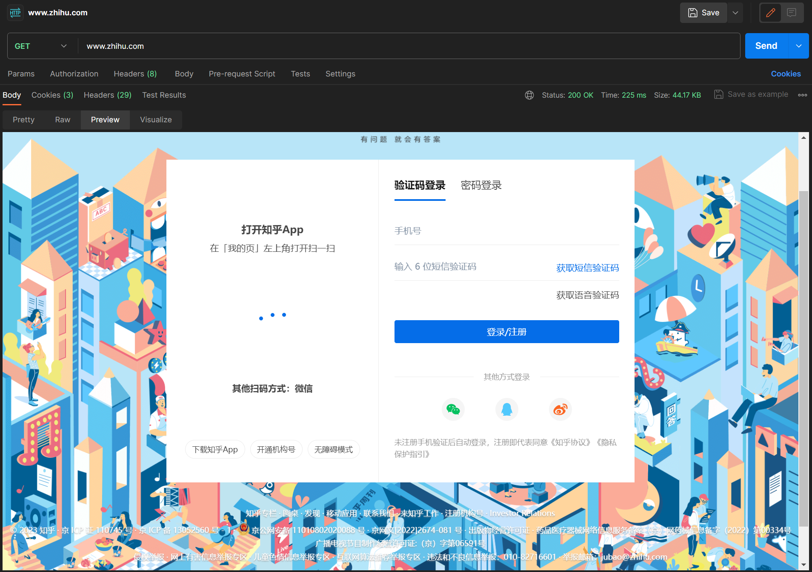
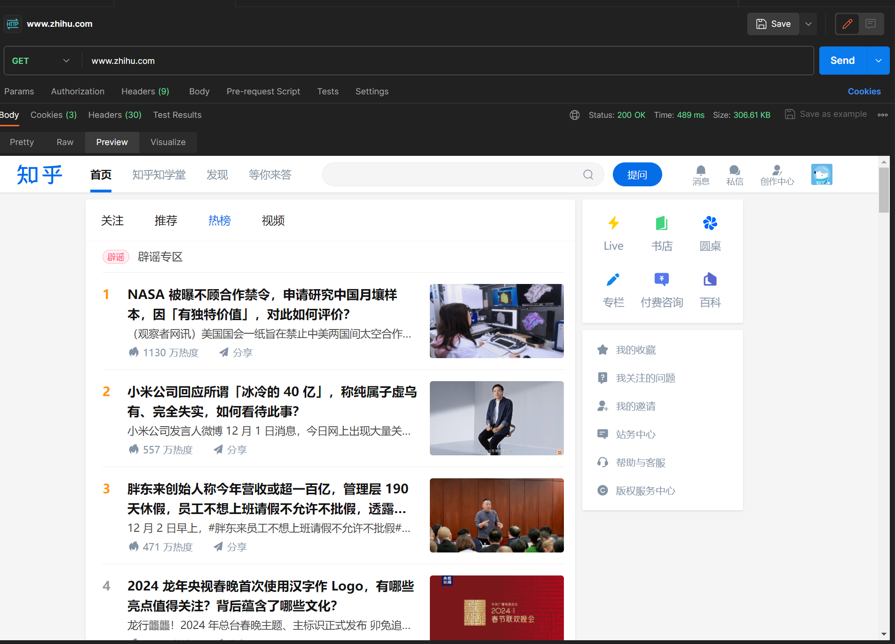
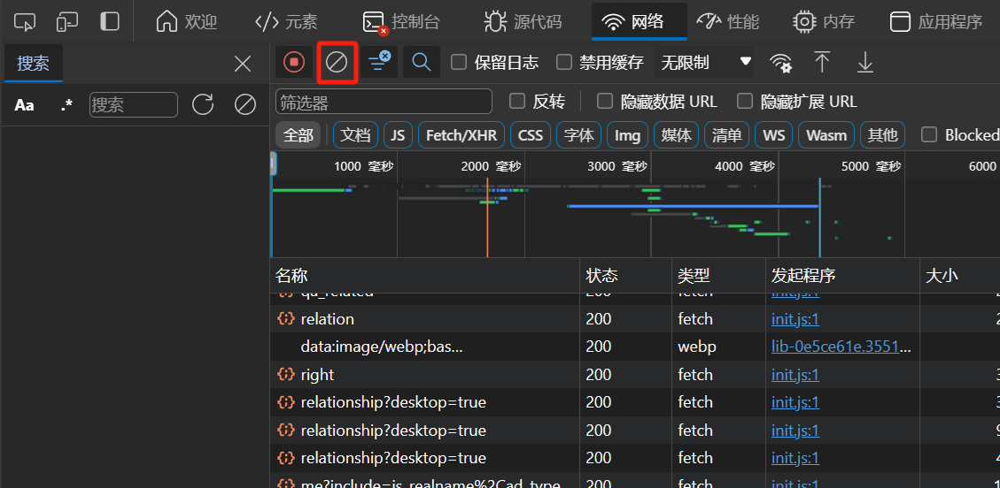
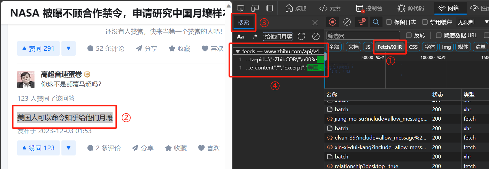
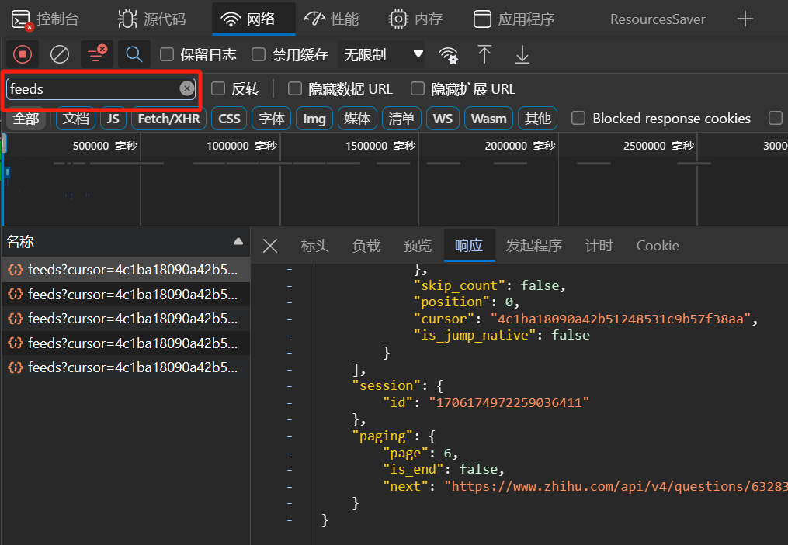
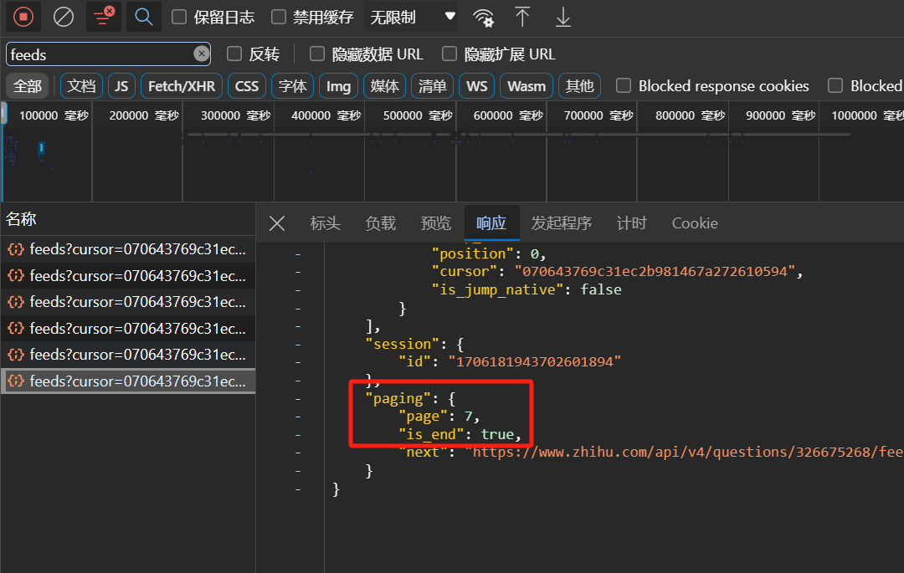

# 爬虫


??? info "我需要什么前置知识？"

    我们期待您已经了解并掌握了 Python 的基础语法以及 Web 相关知识，如果您对此有任何疑问，可以参考：

    - [科协技能引导文档 Python 部分](https://docs.net9.org/languages/python/)
    - [科协技能引导文档 Web 部分](https://docs.net9.org/basic/web/)

    此外，我们还提供了一些 HTTP 相关知识以供参考：

    - [HTTP 协议的历史演变和设计思路](https://www.ruanyifeng.com/blog/2016/08/http.html)
    - [HTTP 有哪些方法可供我们调用？](https://www.w3schools.com/tags/ref_httpmethods.asp)
    - [HTTP 各种响应状态码的含义](https://developer.mozilla.org/zh-CN/docs/Web/HTTP/Status)
    - [HTTP 的 Cookie 是什么？他有怎样的结构？](https://developer.mozilla.org/zh-CN/docs/Web/HTTP/Cookies)

    如果您在阅读本文档时遇到了任何困难或疑问，欢迎在下方评论区提问讨论。当然，您也可以查询相关官方文档或者选择尝试向 ChatGPT 提问。

??? info "环境配置"

    我们建议您使用 3.10 版本的 Python，您可以通过 pip 包管理工具来安装本文档所需库。如果您此前没有接触过 pip，您可以通过阅读 [Python 包管理](https://docs.net9.org/languages/python/pip/) 这篇文章来进行学习。以下是本文档所需的库：

    ```
    beautifulsoup4
    requests
    lxml
    tqdm
    notebook
    jupyter
    webdriver-manager
    selenium
    scrapy
    ```

## 环境配置

本文档中主要使用了以下 Python 第三方库：

- requests：提供了一些 Python 中易于调用的 HTTP 请求接口。
- beautifsoup4：提供了一些解析和遍历 HTML/XML 结构的接口，便于提取所需数据。
- selenium与webdriver-manager：模拟用户在浏览器中的操作。

## 什么是爬虫？

在解释什么是爬虫之前，请先让我们搞明白什么是**上网**。上网可以被简单地认为是“浏览器按照用户意愿，向服务器发送一系列请求，并将服务器的响应呈现给用户”。

??? example "一个简单的例子"

    您浏览本文档时就在上网，而这一过程所做的无非是您通过浏览器向我们的服务器发出如下请求：“我想要学习爬虫相关内容，请把相关教程发送到我的设备上。”

    在接收到您的请求后，服务器会传回一个 HTML 文件以及一些其他附属文件，最后在浏览器中展现为您现在所阅读的文档。

爬虫是一种可以模拟网页浏览器向网站发送并处理请求的自动化脚本，帮助我们获得服务器的数据，进而用于其他需求。借助于爬虫，理论上我们可以依照需求处理一切与网络请求有关的内容，比如实现某某网站的抢票、实现某某网站音视频及文字的批量获取。

## 爬前须知

截至目前，我们已经搞清楚了何为爬虫以及为何爬虫。但在正式开始爬虫的教学之前，我们还要了解什么不可为以及什么可为。

### 不可为

首先，我们爬取的数据来自互联网，而互联网中存储着大量的个人用户信息、企业信息。理论上只要我们的爬虫技术足够高超，我们就能获得互联网上存储的任何信息。然而对于用户未授权数据的爬取是违反相关法律法规的，因此我们在爬取数据前一定要确保自身行为的合法性。

??? danger "爬虫虽好，但不要贪爬哟"

    电影《孤注一掷》中的程序员男主被缅北电诈集团强迫从事非法爬虫与网络入侵，为犯罪分子提供了巨额非法收入。“只要爬虫技术高，薪资千万不用愁。”但面对金钱利益诱惑，我们一定要守住法律与道德底线。

其次，由于爬虫是高效的自动化脚本，其向服务器发出请求的频率可能远超普通人类正常使用服务所能产生的请求频率。在这种高频请求下，服务器可能会面临一些攻击：

- DoS (Denial of Service) attack：拒绝服务攻击，通过构造大量的（尤其是繁重的，也就是 CC 攻击）请求使得服务器“忙不过来”，让服务器无法正常服务。
- DDoS (Distributed Denial of Service) attack：分布式拒绝服务攻击，在 DoS 攻击的基础上改为多个客户端同时对目标网站发起大量请求。

??? example "简单的例子"

    尽管谈论攻击还比较遥远，但我们不妨考虑以下日常生活场景：
    - 当你在高考成绩查询网站上准时查询时。
    - 双十一午夜十二点，当你在某网购平台上下单时。
    - 周四下午一点，当你在“新清华学堂”公众号上抢 40 元前排学生票时。
    - 二字班科协迎新会上，当你没搞懂如何抢答，于是反复提交答案导致服务器被干爆时。

如果服务器处理请求的能力较差，短时间内的大量请求可能导致服务器瘫痪，对服务提供者造成经济损失。故意攻击服务器的行为是违反相关法律法规的，我们要时刻避免这种现象的发生。

### Requests Headers

上面简单介绍了什么不可为，接下来介绍一下我们应怎样知道什么是可为的。但在这之前，我们要先了解一下 Requests Headers 相关内容。

我们已经知道爬虫是向服务器发送特定网络请求并接收响应的自动化高效脚本。通常来说，一次网络请求的主要内容包括：

- 你是谁：User-Agent 与 Cookie 。
- 你从哪里来：IP （不包含在 Requests Headers 中，而是包含在 TCP/IP 协议栈中的 IP 数据包中，这里我们略过）。
- 你来这里干什么：Method 与 Parameter （如果是 POST 请求的话还会有更多内容，但是作为爬虫的话可以略微简化）。

User-Agent 用于标识发起请求的客户端应用程序或设备的信息。它提供了关于客户端的一些基本信息，例如浏览器类型、操作系统、版本号等，以便服务器能够根据这些信息提供适当的响应。以下是几个例子：

- 我的这台 Windows 机器上 Edge 浏览器的 User-Agent： `Mozilla/5.0 (Windows NT 10.0; Win64; x64) AppleWebKit/537.36 (KHTML, like Gecko) Chrome/119.0.0.0 Safari/537.36` 。
- Python requests 库默认的 User-Agent： `python-requests/{version}`，其中 `version` 为 Python 的版本号。 
- Postman 默认的 User-Agent： `PostmanRuntime/{version}`，其中 `version` 为 Postman 的版本号。

??? question "什么是 Postman ？"

    以下内容来自 ChatGPT：

    Postman是一种用于测试和开发API的工具。它提供了一个用户友好的界面，使开发人员能够轻松地创建、发送和调试HTTP请求，并查看服务器的响应。Postman支持多种HTTP请求方法，如GET、POST、PUT、DELETE等，还可以设置请求头、请求体和参数。开发人员可以使用Postman来测试API的功能、验证其正确性，并进行性能测试。

    除了发送请求和接收响应外，Postman还提供了其他功能，如自动化测试、断言验证、环境变量管理、协作和版本控制等。它还支持集成到开发流程中，可以与版本控制系统和持续集成工具进行集成，以便团队协作和自动化测试。

    Postman还提供了一个云平台，允许团队成员共享API文档、测试集合和环境配置，以便更好地协作和管理API开发过程。

    总而言之，Postman是一个功能强大的API开发和测试工具，可以帮助开发人员更高效地测试、调试和管理API。

Cookie 是一种在客户端（通常是 Web 浏览器）和服务器之间传递的小型数据文件。它由服务器在 HTTP 响应中设置，并在随后的请求中由客户端包含在 HTTP 标头中发送回服务器。在 Cookie 中，往往记录了诸如用户登录状态、个性化设置、会话记录等内容。以众多网站的自动登录为例，服务器接收客户端发出的 Cookie ，然后与服务器上存储的用户信息进行查找校验，选取符合的用户信息免密登录。

Method 是 HTTP 请求中的方法，Parameter 是这一过程传入的参数。我们可以调用的 Method 诸如 GET, POST, DELETE 等。

### 何可为

通过 Requests Headers ，服务器可以大概了解发送请求的用户的基本信息。服务器可以编写 `robots.txt` 文件来规定不同的爬虫对于网页上各文件的访问权限。但请注意，这份 `robots.txt` 文件只是一份“君子协议”，并没有严格的限制，网站会采取其他手段防止恶意攻击。

通过在网站域名后加 `/robots.txt`，我们可以访问该网站的 `robots.txt` 文件。但请注意，**子域名**的 `robots.txt` 未必与**主域名**的相符。

我们建议您阅读 [Google for developers 对于 robots.txt 文件的说明](https://developers.google.com/search/docs/crawling-indexing/robots/intro?hl=zh-cn) 来进行简单的了解。这里我们仅讲解几个例子。

- [百度](https://www.baidu.com)

```
User-agent: Baiduspider
Disallow: /baidu
Disallow: /s?
Disallow: /ulink?
Disallow: /link?
Disallow: /home/news/data/
Disallow: /bh

User-agent: Googlebot
Disallow: /baidu
Disallow: /s?
Disallow: /shifen/
Disallow: /homepage/
Disallow: /cpro
Disallow: /ulink?
Disallow: /link?
Disallow: /home/news/data/
Disallow: /bh

# 此处略去部分内容

User-agent: *
Disallow: /
```

解读：一律禁止除了我指定的爬虫外的所有爬虫。而对于我指定的爬虫，有些文件你也是不能访问的。

- [淘宝](https://www.taobao.com) 

```
User-agent: Baiduspider
Disallow: /

User-agent: baiduspider
Disallow: /
```

解读：一律禁止百度爬虫对任何文件的访问。

- [天猫](https://www.tmall.com) 

```
User-agent: * 
Disallow: /
```

解读：一律禁止所有爬虫对任何文件的访问。

- [虎扑体育](https://www.hupu.com/)

```
User-agent: *
Allow: /

Sitemap: https://bbs.hupu.com/sitemap_index.xml
Sitemap: https://bbs.hupu.com/sitemap/sitemap_boards.xml
Sitemap: https://voice.hupu.com/sitemap_index.xml
Sitemap: https://nba.hupu.com/players/index.xml
```

解读：欢迎任何爬虫来爬我。此外，我还提供了 Sitemap（站点地图）来为爬取提供便利。

??? "什么是 Sitemap？"

    请参考 [Google for developers 对于 Sitemap 的解释](https://developers.google.com/search/docs/crawling-indexing/sitemaps/overview?hl=zh-cn)

- [虎扑社区](https://bbs.hupu.com/)

```
User-agent: *
Request-rate: 1/1
Disallow: /api/
Disallow: /ajax/
Disallow: /profile.php?*
Disallow: /hack/
Disallow: /template/
Disallow: /attachment/
Disallow: /gearfeedback/
Disallow: /*_*.html$

Sitemap: https://bbs.hupu.com/pc-sitemap.xml
```

解读：注意这里就发生了我们之前提到过的子域名与主域名 `robots.txt` 可能不相同的情况。在这里，虎扑社区限制对于所有爬虫，每秒访问次数不可超过一次，且禁止了对于部分文件的访问。

## 如何构建爬虫？

构建爬虫的关键在于分析服务器请求。我们需要分析期望获得的数据在哪个或哪些请求中，进而构建“API Chains”。经过分析后我们就可以尝试构建爬虫了。本文主要介绍两种方法，一种是利用 HTTP 库（本文使用 requests）发出请求，然后利用解析库（本文使用 BeautifulSoup）解析 HTML/XML，用 json 包解析 JSON，最后得到想要的数据；另一种是利用 selenium 的 webdriver，模拟用户在浏览器中的行为，从而获取数据。在本文的最后，还会简单介绍利用 Scrapy 框架进行爬虫的方法，但不作为本文的重点。

以下是三种典型的网络请求的响应以及我们解析他们的手段。

- JSON：利用 Python 内部库 json 对文件直接解析。
- HTML：使用 BeautifulSoup 进行解析。
- 二进制文件：直接保存。

## 使用 HTTP 库和解析库

### requests 入门

首先，让我们简单了解一下 requests。requests 用于发送 HTTP 请求和处理响应，它提供了简单且直观的方法来进行网络通信，比如 `get`，`post`，`put`，`delete` 等等。对于爬虫来说，我们常用的方法是 `get` 和 `post`。

使用他们的方法很简单，以 `get` 为例，你只需要通过 `r = requests.get("https://docs.net9.org")` 即可构建一个向本指引文档网站发出 `GET` 请求的 `requsets` 对象 `r`。当然，你还可以通过字典的形式传参，比如：

```Python
>>> payload = {'key1': 'value1', 'key2': 'value2'}
>>> r = requests.get('https://httpbin.org/get', params=payload)
```

我们可以通过 `r` 的 `url` 属性来查看结果：

```Python
>>> print(r.url)
https://httpbin.org/get?key2=value2&key1=value1
```

可以看到，我们成功通过 `params` 完成了传参的需求。当然，你也可以利用字典内嵌套列表来进行传参，具体留给读者尝试。

获取响应的 `requests` 对象 `r` 后，我们可以通过其 `text`，`content`，`raw` 属性或 `json` 方法来获取响应结果。其中 `raw` 属性我们使用较少。
- `text` 属性返回响应内容的字符串形式，他会自动对响应内容进行解码，我们可以通过修改 `r.encoding` 来设置其编码，如 `r.encoding = "utf-8"`。由于其能对字符串进行适当的解码，通常被用来解析 HTML 页面或纯文本内容。
- `content` 属性返回响应内容的二进制形式，不会对响应内容进行解码，多用于处理二进制文件，如图像等。
- `json` 方法尝试将响应内容解析为 JSON 格式，并返回解析后的 Python 对象。
- `raw` 属性返回底层的原始响应内容。它返回一个 `HTTPResponse` 对象，通常情况下，我们不需要直接访问 `raw` 属性，除非需要处理非文本或非 JSON 的特殊响应数据。

一般情况下，我们在发送请求时要附带 headers 信息，我们可以利用字典来传递，比如：

```Python
>>> url = 'https://api.github.com/some/endpoint'
>>> headers = {'user-agent': 'my-app/0.0.1'}
>>> r = requests.get(url, headers=headers)
```

### headers 的重要性

接下来，我们通过几个实验来了解 headers 的重要性。我们利用 Postman，使用默认 headers 对 [知乎热榜](www.zhihu.com/hot/) 发起 GET 请求，发现返回的响应如下图所示：



可以看到这里需要输入账号密码登录才可以查看知乎内容。如果我们在浏览器中曾登录过知乎账号，再次进行访问时就可以自动登录。为了实现自动登录，我们可以尝试在 headers 中添加 cookie 来传递用户登录信息。cookie 的获取可以借助浏览器中的**检查**。我们可以在浏览器中右键打开检查页面。当然我们也可以使用默认的 F12 快捷键。随后我们找到**网络**部分，重新访问知乎，可以看到时间线最靠前的文件为 `hot`，我们可以找到**请求标头**中的 cookie 部分内容，这其中记录了我们的登录状态。新建 Postman headers 键值对，其中 key 为 cookie，value 为 刚刚找到的 cookie。重新发送 GET 请求，得到如下响应：



可以看到当我们在 headers 中加入适当 cookie 就可以实现免密登录。

接下来我们再看另一个例子。在 Python 中尝试使用 requests 默认 headers 访问 [北京卫健委](https://wjw.beijing.gov.cn/)。

```Python
>>> url = "https://wjw.beijing.gov.cn/"
>>> response = requests.get(url=url)
>>> print(response.status_code)
403
```

我们发现响应的状态码为 403，证明服务器由于客户端原因拒绝了我们的访问。其实拒绝访问的原因是我们在利用 requests 的默认 headers 进行 GET 请求时，网站通过我们的 User-Agent 直接发现了我们爬虫的身份，于是拒绝了我们的访问。下面我们尝试将 requests 的 headers（组织形式为字典） 中的 User-Agent 修改为我们浏览器的 User-Agent（查找本地浏览器 User-Agent 的方法与上述查找 cookie 的方法类似）。

!!! info "fake-useragent 第三方库"

    我们还可以利用 fake-useragent 第三方库生成随机的 User-Agent 字符串，以模拟不同的浏览器和设备来一定程度上突破某些网站的反爬机制。本文档仅作入门教学，设计样例无需借助 fake-useragent，结合篇幅原因不多赘述，有兴趣的读者可以阅读 [fake-useragent官方文档](https://fake-useragent.readthedocs.io/en/latest/) 自行学习。

```Python
>>> headers = {
    "User-Agent": "Mozilla/5.0 (Windows NT 10.0; Win64; x64) AppleWebKit/537.36 (KHTML, like Gecko) Chrome/119.0.0.0 Safari/537.36",
}
>>> response = requests.get(url=url, headers=headers)
>>> print(response.status_code)
200
```

此时响应的状态码为 200，证明此时我们成功访问了该网站。

综上，合理修改 headers 既可以帮助我们免密登录，也可以使我们的身份由爬虫变为浏览器，从而避免被部分网站拒绝访问。此外，我们还可以使用代理 IP 等手段来突破某些网站的反爬机制，有兴趣的读者可以自行学习。

### Beautiful Soup 入门

最后，在开始正式爬虫之前，我们还要简单学习一下 Beautiful Soup（以下简称为 BS）。BS 将复杂的 HTML 文档转换成一个复杂的由 Python 对象构成的**树形**结构，BS 包含 4 种类型的对象: `Tag`，` NavigableString`，`BeautifulSoup` 和 `Comment`。

**Tag**

`Tag` 与 HTML/XML 中的 tag 类似，有以下**属性**。

- `name`：返回标签的名称，即标签的类型。
- `attrs`：返回一个字典，包含标签的所有属性和对应的值。
- `text`：返回标签内的文本内容，不包括子标签的文本。
- `string`：返回标签内的文本内容，包括子标签的文本（其实返回了一个 `NavigableString` 对象）。
- `parent`：返回标签的父标签。
- `contents`：返回标签的所有子节点，以列表形式返回。
- `next_sibling`：返回标签的下一个兄弟节点。
- `previous_sibling`：返回标签的上一个兄弟节点。

通过以下例子，您可以大致了解他们与 HTML/XML 中 tag 的对应关系。这里用到了 `BeautifulSoup` 对象的构造函数解析 HTML 从而获得 `Tag` 对象。有关前者的内容，我们稍后会提及，这里可以忽略细节。当然，您也可以使用 `BeautifulSoup.new_tag(name, attrs, **kwargs)` 来构造一个 `Tag` 对象。

```Python
>>> html = """
    <html>
        <p id="welcome">Hello, world!</p>
        <div class="CST" id="9#">
            <p>下面是计算机系科协 docs9 网站</p>
            <a href="https://docs.net9.org">计算机系科协 docs9 网站</a>
            <p>上面是计算机系科协 docs9 网站</p>
        </div>
    </html>
    """
>>> bs = BS(html)
>>> tag_p = bs.p
>>> tag_div = bs.div
>>> print(tag_p)
<p id="welcome">Hello, world!</p>
>>> print(tag_div)
<div class="CST" id="9#">
<p>下面是计算机系科协 docs9 网站</p>
<a href="https://docs.net9.org">计算机系科协 docs9 网站</a>
<p>上面是计算机系科协 docs9 网站</p>
</div>
>>> print(tag_p.name)
p
>>> print(tag_div.name)
div
>>> print(tag_p.attrs)
{'id': 'welcome'}
>>> print(tag_div.attrs)
{'class': ['CST'], 'id': '9#'}
```

通过上述输出结果我们注意到，`Tag` 对象 `attrs` 中的 `class` 属性是一个列表。这是因为从 HTML4 开始，定义了一系列可以包含多个值的属性，而 `class` 就是最常见的**多值**属性。BS 选择把 HTML 中的多值属性转化为 Python 中的**列表**。

对 `Tag` 的 `attrs` 属性的操作与**字典**相同，也即您可以直接利用 `Tag[attr]` 来访问 `Tag` 的某个 `attr` 属性。下面是一个例子。

```Python
>>> print(tag_div["class"])
['CST']
>>> tag_div["style"] = "font-size: 2em"
>>> print(tag_div.attrs)
{'class': ['CST'], 'id': '9#', 'style': 'font-size: 2em'}
```

对于 `text` 和 `string` 的描述可能有些令人迷惑，下面的例子能很好地帮助您理解它们的区别。

```Python
>>> print(tag_p.text)
Hello, world!
>>> print(tag_div.text)

下面是计算机系科协 docs9 网站
计算机系科协 docs9 网站
上面是计算机系科协 docs9 网站
>>> print(tag_p.string)
Hello, world!
>>> print(tag_div.string)
None
```

简单来说，`text` 属性可以认为是**递归**返回该 `Tag` 及其后代节点中的所有文本内容，而 `string` 属性仅返回该节点自身的文本内容。

其余的属性不难理解其含义，本文就不列出相关例子，感兴趣的读者可以自行探索。

此外，`Tag` 还有以下方法。我们建议您略读以下部分即可。您可以注意到，下文中有“find”字眼的方法的说明都比较类似，稍后我们会以 `find_all()` 为代表作简单介绍。此外，下文中所提到的“生成器”指的是 BS 中的一个可迭代结果集 `ResultSet`（您可以认为它与 Python 内置的列表类似）。

- `find_all(name, attrs, recursive, text, limit, **kwargs)`：在当前 `Tag` 对象的后代节点中查找匹配指定条件的所有元素，并返回一个生成器。
- `find(name, attrs, recursive, text, **kwargs)`：在当前 `Tag` 对象的后代节点中查找第一个匹配指定条件的元素，并返回该元素。可以认为是 `limit` 为 1 的 `find_all()`，只不过 `find()` 返回的是一个元素而不是一个生成器。
- `find_parent(name, attrs, text, **kwargs)`：在当前 `Tag` 对象的父节点中查找第一个匹配指定条件的元素，并返回该元素。
- `find_all_next(name, attrs, text, limit, **kwargs)`：在当前 `Tag` 对象之后查找匹配指定条件的所有元素，并返回一个生成器。
- `find_next(name, attrs, text, **kwargs)`：在当前 `Tag` 对象之后查找第一个匹配指定条件的元素，并返回该元素。
- `find_all_previous(name, attrs, text, limit, **kwargs)`：在当前 `Tag` 对象之前查找匹配指定条件的所有元素，并返回一个生成器。
- `find_previous(name, attrs, text, **kwargs)`：在当前 `Tag` 对象之前查找第一个匹配指定条件的元素，并返回该元素。
- `find_all_next_sibling(name, attrs, text, limit, **kwargs)`：在当前 `Tag` 对象之后的兄弟节点中查找匹配指定条件的所有元素，并返回一个生成器。
- `find_next_sibling(name, attrs, text, **kwargs)`：在当前 `Tag` 对象之后的兄弟节点中查找第一个匹配指定条件的元素，并返回该元素。
- `find_all_previous_sibling(name, attrs, text, limit, **kwargs)`：在当前 `Tag` 对象之前的兄弟节点中查找匹配指定条件的所有元素，并返回一个生成器。
- `find_previous_sibling(name, attrs, text, **kwargs)`：在当前 `Tag` 对象之前的兄弟节点中查找第一个匹配指定条件的元素，并返回该元素。
- `append(element)`：将指定的元素作为当前 `Tag` 对象的子节点追加到末尾。
- `insert(position, element)`：在指定的位置将指定的元素作为当前 `Tag` 对象的子节点插入。
- `extract()`：从文档中提取当前 `Tag` 对象，并将其从文档树中移除。
- `replace_with(new_tag)`：使用新的标签替换当前 `Tag` 对象。

`find_all()` 方法接受以下参数：

- `name`：指定要匹配的元素 HTML 标签，可以是字符串、正则表达式或列表，可以省略。
- `attrs`：以字典形式指定要匹配的元素属性，可以省略。
- `class_`：指定要匹配的元素的 CSS class（注意这里为了避免与 Python `class` 重复，参数名为 `class_`），可以省略。
- `string`：指定要匹配的元素所包含的字符串，可以省略。
- `limit`：指定最多匹配几个元素，可以省略，默认显示全部匹配结果。
- `recursive`：指定是否递归搜索子节点，可以省略，默认值为 `True`。
- `**kwargs`：其他关键字参数，用于进一步筛选元素，可以省略。

带有“find”字眼的方法是爬虫最常用到的。由于其他方法比较好理解且本文档不会用到，因此不作介绍，供感兴趣的读者自行了解。

**NavigableString**

`NavigableString` 主要是通过其他对象的 `string` 属性得到的，当然您也可以利用其自身构造函数 `NavigableString(string)` 来进行构造。它继承自 Python 的字符串类，并提供了一些额外的方法和属性来操作和访问文本内容。其整体上的方法与 `Tag` 类似，读者可以类比自行学习。

**BeautifulSoup**

`BeautifulSoup` 对象是 BS 中的核心对象，用于表示解析后的 HTML/XML。您可以通过 `BeautifulSoup(markup, parser)` 来进行构造。其中 `markup` 是要解析的 HTML/XML 字符串，而 `parser` 是解析器的类型，默认为 Python 库中的 HTML 解析器 `"html.parser"`，当然您也可以选择 `"lxml"`，`"xml"` 等解析器。

`BeautifulSoup` 对象与 `Tag` 对象很相似，但对比来看，它处理的是 HTML/XML 文档，而 `Tag` 处理的则是 HTML/XML 中的某个 tag。它的属性与接口也与 `Tag` 类似，请读者类比自行学习。

不过需要额外指出的是，我们可以通过访问 `BeautifulSoup` 的标签属性来得到该对象中的符合要求的第一个 `Tag` 对象，这与 `find()` 在一定程度上是等效的，但这只能适用于查找特定标签类型的情况。我们正是如此获得上文中的 `tag_p` 与 `tag_div` 的。

**Comment**

`Comment` 用于表示 HTML/XML 中的注释内容，使用很简单，也与上述类似，本文不作赘述。

## 第一阶段实战

至此，利用 HTTP 库和解析库进行爬虫的基本工具我们已经了解了，接下来让我们在实际操作中进行学习。本文档准备了两个实践范例以供大家学习，一个是爬取知乎热榜链接，另一个是爬取知乎某问题下的所有回答。

### 爬取知乎热榜链接

我们平常在浏览器中看到的网页主要是通过 HTML 渲染得到的，因此我们可以点击**检查**界面中的**在页面中选择一个元素以进行检查**或使用快捷键 Ctrl + Shift + C，然后点击网页中的元素以快速找到相应元素在 HTML 中的位置。我们需要获取热榜中每个话题对应的详情页连接，而根据常识，点击标题就可以跳转到详情页，于是利用上述方法查找即可找到热榜话题所对应的链接。


进行类似分析，我们可以发现热榜中的每一个条目都被封装在一个 `class` 为 `HotItem-content` 的容器中。因此我们可以利用 BS 来筛选该 HTML 中特定类的容器从而获取到热榜链接。

我们先给出代码，随后作以解释。

```Python
import requests
from bs4 import BeautifulSoup as BS
import json
from typing import List
def get_zhihu_hot_urls() -> List[str]:
    """
    Get the hot urls list of zhihu

    Returns:
        The hot urls list of zhihu
    """
    url = "https://www.zhihu.com/hot"
    headers = {}
    with open("config.json", "r") as f: # you should create your "config.json" according to your User-Agent and cookie
        config = json.load(f)
    headers["User-Agent"] = config["User-Agent"]
    headers["cookie"] = config["cookie"]

    resp = requests.get(url=url, headers=headers)
    soup = BS(resp.text) # you can parse another parser like lxml instead
    hot_list = []
    for item in soup.find_all("div", class_="HotItem-content"):
        tag = item.find("a")
        hot_list.append(tag["href"])
    return hot_list
```

由于之前我们已经验证，若想浏览知乎内容必须要进行登录，因此需要在 `headers` 中添加 `"cookie"` 实现用户登录。此外，我们还要修改 `"User-Agent"` 为我们浏览器的 User-Agent 从而尽量避免被识别为爬虫。接下来，我们就可以利用 `requests.get(url, headers)` 来向知乎热榜发出请求，并将响应结果存储在 `resp` 中。

由于我们要解析的是响应中的 HTML，因此调用 `resp.text` 从而获得响应的文本字符串，把他构造为 `BeautifulSoup` 对象 `soup`。

接下来我们调用 `soup.find_all()` 从而找到所有标签名为 `div` 且 CSS class 为 `HotItem-content` 的 `Tag` 对象。随后我们遍历刚刚得到的生成器中的元素 `item`，调用其 `find()` 方法从而找到所有标签名为 `a` 的 `Tag`，也即话题 url 所在的标签。对于刚刚被找到的 `tag` 对象，我们直接把它的 `attrs` 中的 `href` 属性加入 `hot_list`。最后在遍历完成后，返回 `hot_list` 即可实现知乎热榜链接的爬取。

### 爬取知乎某问题下的所有回答

这一部分我们以编号为 632832873 的 [话题](https://www.zhihu.com/question/632832873) 为例进行示范。

首先我们仿照上一个示例，运行以下代码（`headers` 的配置与上相同）。

```Python
>>> url = "https://www.zhihu.com/question/632832873"
>>> resp = requests.get(url=url, headers=headers)
>>> file = open("resp.html", "w")
>>> file.write(resp.text)
```

随后我们检查 `resp.html` 中的内容，发现其中并没有包含该话题下的所有回答，而只是部分回答。这里需要考虑到 Web 相关的**异步**请求响应的内容。当我们访问一个话题下的回答时，服务器并没有把所有回答都作为响应返回给用户，而是仅返回了部分回答。当我们向下滑动，直到展示了所有服务器返回的回答后，浏览器才会再次向服务器发起请求获取更多的回答。如此考虑后，就不难理解为什么简单地调用一次 `requests.get()` 是不能展现所有回答的了。

??? example "异步请求响应"

    异步请求响应这项技术目前被各类网页广泛使用，下面是一些常见的例子。
    - 当你在 [B 站](https://www.bilibili.com) 首页上尝试刷到计算机系科协的视频时，你要不断向下滑动，然而每次都只能获取不超过指定数目的视频。
    - 当你在 [今日头条](https://www.toutiao.com) 首页上尝试刷到清华大学相关内容时，你要不断向下滑动，然而每次都只能获取不超过指定数目的内容。
    - 当你在 QQ 群“28届智能体原油会”中翻阅历史聊天记录想要看看群友聊了什么的时候，你要不断向上滑动，然而每次都只能获取不超过指定数目的聊天记录。（QQ 其实是一个内嵌浏览器的 app，当你在使用 QQ 时，大部分时间你其实都在不断向服务器发出请求并接收响应）

那么我们应该如何获取所有回答呢？我们已经明确，正是因为异步请求响应，我们才不能一次性获取某个话题下的全部回答。而异步请求响应的文件一般在 XHR 中，那么这时我们就可以通过追踪 XHR 来尝试找到突破口。这时又要用到之前提到过的浏览器中的**检查**。由于我们要追踪的是“加载回答”的响应，因此在第一次得到响应后要先**清除网络日志**，我们可以点击**检查**页面中的相应图标，也可以利用快捷键 Ctrl + L 来完成。



随后向下滑动，直至出现加载新问题的界面，这时我们可以尝试去定位究竟是哪个 XHR 文件可能作为这些回答数据的载体。我们可以利用如下简洁的方法：先在检查页面中**筛选** Fetch/XHR ，然后使用快捷键 Ctrl + F 打开**搜索**工具来搜索网页中的某段文字出现在哪个 XHR 文件中。以下是一个简单的例子。



通过这种方式我们可以发现，相关回答的数据被保存在包含“feeds”字眼的 Feeds 文件中。于是我们可以在**筛选器**中筛选包含“feeds”字眼的文件。

??? question "什么是 Feeds？"

    Feeds 是一种常见的数据源格式，用于获取和跟踪网站上的内容更新。Feeds 文件通常以 RSS 或 Atom 格式提供，包含了发布者的文章、新闻、博客等更新的摘要或全文内容。

    由于本文只作入门讲解，我们只需简单认为 Feeds 文件是一种包含发布者内容更新摘要或全文的格式，用于帮助爬虫跟踪和获取网站上的最新内容。



大致观察筛选得到的**响应**文件，发现他们的组织形式类似，都是一个字典，该字典共有 3 个 `key`：

- `data`：是一个列表，其中每个元素是一个字典，推测每个字典中存储着每个回答的相关信息。
- `session`：是一个字典，仅包含一个键值对，其中 `key` 为 `"id"`，而 `value` 为一段数字字符串。
- `paging`：也是一个字典，包含三个键值对。`page` 对应一个正整数，`is_end` 对应一个布尔值，`next` 对应一个 url 字符串。推测上述三个 `key` 分别代表当前回答所在页、是否到达页尾、下一次发送请求的 url。


我们上面进行了四个推测。

对于第一个推测，我们简单比对文件与网页显示内容即可验证。

对于第二个推测，我们也进行相应比对，发现 `page` 较大的文件中对应的 `data` 内部的回答一定处于相对靠后的位置，也得以验证。

而对于该话题，我们不方便验证第三个推测，因为该话题下有太多回答，想要找到最后一条回答比较麻烦。于是我们考虑回答相对较少的 [该问题](https://www.zhihu.com/question/326675268)。不断向下滑动，筛选 Feeds 文件响应，发现当滑动到回答底部后，已接收的 Feeds 文件响应中有一个文件恰好对应回答的最后一页，其 `page` 为 7，`is_end` 为 `true`。因此第三个推测也得以验证。



至于第四个推测，我们可以观察文件名、`page`、`next` 之间的关系。可以发现每个 `next` 中包含一段形如 `feeds?cursor={x}` 的字段，其中 `x` 为某一数字序列，而 `feeds?cursor={x}` 正与他们的文件名开头格式相似。再考虑 `page`，发现对于 `page` 为 `k` 的文件响应，他的 `next` 中的 `feeds?cursor={x}` 字段即为 `page` 为 `k + 1` 的文件名开头字段的一部分。因此第四个推测也在一定程度上得到了验证。

??? question "cursor 是什么？"

    在 Web 开发中，cursor 一般用来标记网页当前滑动的位置。其具体计算与解析的规则一般与服务器的后端有关，这里我们不作深入了解。


!!! note "“猜”的艺术"

    您可能注意到，我们在爬虫时经常通过“猜”来尝试获取相关信息。这种感觉是正确的，我们在进行 API 分析时常常需要根据文件名、变量名等内容来猜测他们的含义，然后进行简单的实验即可验证。

    您可以在实践的过程中找寻这种“猜”的感觉，体会这门艺术。

至此，我们已经大概理解了 `data` 和 `paging` 的含义，然而 `session["id"]` 的含义我们尚不明了。首先我们要验证其是否有用。通过比对不同上述文件响应，发现他们的 `session["id"]` 是相同的，并且作为参数被包含在 `paging["next"]` 中。那是否意味着这段数据是无用的呢？在刚刚接触这个问题时我们很可能会认为这是无用的，但是在后续过程中容易发现，当我们过一段时间或者是换一个浏览器再次发出请求时，`session["id"]` 也会随之发生改变。因此我们推测其很可能与 `cookie` 有着类似的效果，于是在第一次构造 url 请求时，我们需要提前获取 `session["id"]`。

在获取 `sessionId` 时，我们很容易想到可以利用上述 Feeds 文件从而解析获得。但是实际上在我们获取某个问题下的响应时，该文件并不会直接发送给我们，而是当我们向下滑动加载更多回答时才会从服务器接收相应内容。因此我们就需要尝试从其他角度来获取相关信息。这里我们不妨从 HTML 入手，考虑其中是否包含 `sessionId` 信息。我们先向下滑动以获取 Feeds 文件，然后在其中找到 `session["id"]`，然后复制下来，利用 Ctrl + F 来检索包含该串数字的文件。发现除了 Feeds 文件以外，还有一个 HTML 文件中也包含了这段数字，且这个 HTML 文件是在向下滑动前到达浏览器的。于是我们就可以先利用 BS 来解析该 HTML，然后利用 Python 内置正则表达式库来获得 `sessionId`。


在构造第一次请求的 url 后，我们就可以不断通过 `requests.get()` 来获取响应。然后把响应转化为 `json` 对象进行解析，把其中 `data` 属性加入 `answers` 列表。不断重复上述内容，直到 `paging["is_end"]` 为 `true`，即到达尾页。下面提供一份代码示例以供参考学习。

```Python
def get_all_answers(qid: str) -> List[Dict]:
    """
    Get all answers of a question

    Args:
        qid: The id of the question

    Returns:
        The list of all answers
    """
    headers = {}
    with open("config.json", "r") as f: # you should create your "config.json" according to your User-Agent and cookie
        config = json.load(f)
    headers["User-Agent"] = config["User-Agent"]
    headers["cookie"] = config["cookie"]

    url = f"https://www.zhihu.com/question/{qid}"
    resp = requests.get(url=url, headers=headers)
    soup = BS(resp.text)
    sessionId = soup.find("script", id="js-initialData").text
    sessionId = re.findall(r'"sessionId":"(.*?)"', sessionId)[0]
    url = f"https://www.zhihu.com/api/v4/questions/{qid}/feeds?include=data%5B%2A%5D.is_normal%2Cadmin_closed_comment%2Creward_info%2Cis_collapsed%2Cannotation_action%2Cannotation_detail%2Ccollapse_reason%2Cis_sticky%2Ccollapsed_by%2Csuggest_edit%2Ccomment_count%2Ccan_comment%2Ccontent%2Ceditable_content%2Cattachment%2Cvoteup_count%2Creshipment_settings%2Ccomment_permission%2Ccreated_time%2Cupdated_time%2Creview_info%2Crelevant_info%2Cquestion%2Cexcerpt%2Cis_labeled%2Cpaid_info%2Cpaid_info_content%2Creaction_instruction%2Crelationship.is_authorized%2Cis_author%2Cvoting%2Cis_thanked%2Cis_nothelp%3Bdata%5B%2A%5D.mark_infos%5B%2A%5D.url%3Bdata%5B%2A%5D.author.follower_count%2Cvip_info%2Cbadge%5B%2A%5D.topics%3Bdata%5B%2A%5D.settings.table_of_content.enabled&limit=5&offset=0&order=default&platform=desktop&session_id={sessionId}"
    answers = []
    while True:
        resp = requests.get(url=url, headers=headers)
        data = resp.json()["data"]
        answers.extend(data)
        if resp.json()["paging"]["is_end"]:
            break
        url = resp.json()["paging"]["next"]
    return answers
```

## 使用 Selenium 和 WebDriver

## 第二阶段实战

## scrapy 简介

## 资源链接

除了本文档之外，您还可以参考：
- [2023年计算机系科协暑培 爬虫部分](https://summer23.net9.org/backend/crawler/) 以及 [课程回放](https://www.bilibili.com/video/BV1fP41147wS?vd_source=6c45737266d4ed9f41c3a60d96161fdd)。
- [2021年计算机系科协暑培](https://www.xuetangx.com/course/THUSAST08091234567890/8571842?channel=i.area.manual_search) （请在学堂在线上加入学习）。
- 赵晨阳学长组织编写的为一字班同学提供的 [Python 小学期预习材料](https://github.com/zhaochenyang20/Sino-Japanese-Relations-analysis)。
- [Python requests 库官方文档](https://requests.readthedocs.io/en/latest/)
- [Python selenium 库官方文档](https://selenium-python.readthedocs.io/)
- [Python BeautifulSoup4 库官方文档](https://www.crummy.com/software/BeautifulSoup/bs4/doc/)
- [Python scrapy 库官方文档](https://docs.scrapy.org/en/latest/)
- [Postman 官方网站](https://www.postman.com/)

??? note "写给计算机系大一同学"

    一般来讲，近几年大一小学期可选语言为：

    - Java：利用老师提供的新闻数据，编写一个运行在安卓平台上的新闻 app，需要实现的可能有：首页随机生成新闻、新闻搜索、新闻分类、浏览记录、收藏等等。
    - Python：第一次大作业是先利用爬虫爬取足够数量的某新闻网页上的新闻，然后基于 django 搭建前后端，利用之前爬取得到的数据编写一个部署在本地的新闻网页，需要实现的可能有：首页随机生成新闻、新闻搜索、新闻分类、添加评论等。第二次大作业是训练一个 LLM，主要任务是基于已有模型进行少量代码补全以及构建测试集进行训练。
    - Rust：搭建一个 OJ 平台。

    如果您打算选修 Python 小学期，我们强烈建议您参加对应年度计算机系科协举办的暑培，提前预习 Web、爬虫与 django 相关内容以减轻小学期的学业压力。此外，我们也建议您阅读 [科协技能引导文档 Django 部分](https://docs.net9.org/backend/django/)。不过也无需太过担心，小学期的给分相对不会太差。只要认真按时完成大作业，都能取得不错的分数。